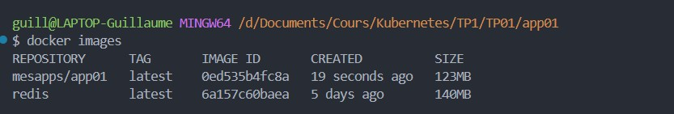
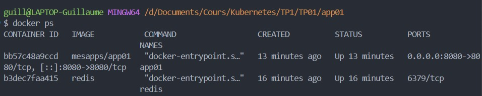
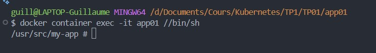
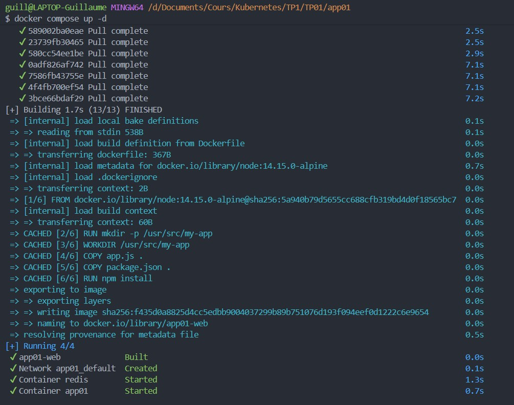
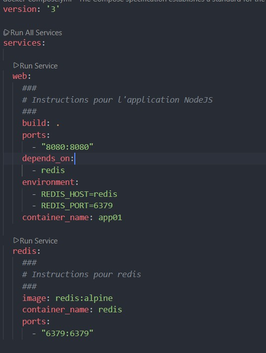
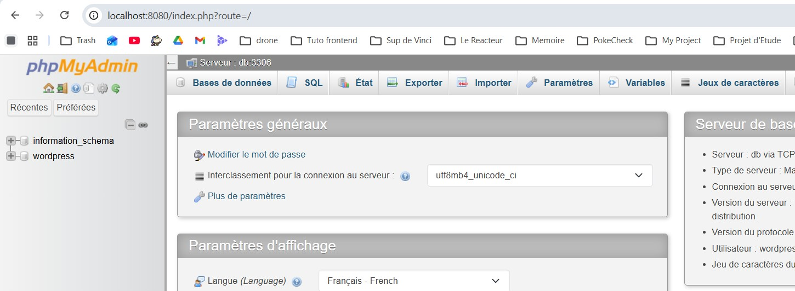
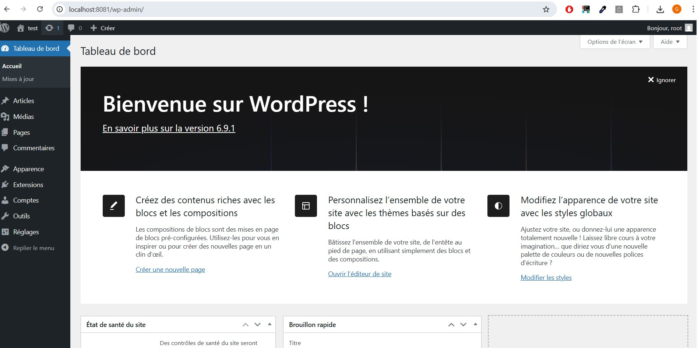

# 🚀 WordPress + MariaDB + phpMyAdmin avec Docker

## 📌 Description

Ce projet déploie un environnement complet **WordPress** avec :

- 🗄️ MariaDB (base de données)
- 🌐 WordPress
- 🛠️ phpMyAdmin (administration de la base)
- 🐳 Orchestration via Docker Compose

---

### Images bien créées


### Tourne sur le port 8080


### Conteneurs en cours d'exécutions


### Accès à l'app "app01"


### Build du fichier docker-compose.yml


### Screen 06


### Tourne bien sur le port 8080


### Connexion à la bdd mariadb sur le port 8080


### Connexion à l'interface wordpress, port 8081


docker-compose.yml
```yml
version: '3'

services:
  db:
    image: mariadb:10
    volumes:
      ##
      # Volume pour MariaDB data (répertoire /var/lib/mysql)
      ##
      - db_data:/var/lib/mysql
    restart: always
    environment:
      ##
      # Variables d'environnement pour accès à la base MariaDB
      ##
      MYSQL_ROOT_PASSWORD: rootpassword
      MYSQL_DATABASE: wordpress
      MYSQL_USER: wordpress
      MYSQL_PASSWORD: wordpress123
    container_name: mariadb

  dbadmin:
    image: phpmyadmin/phpmyadmin
    ports:
      - "8080:80"
    environment:
      ##
      # Variables d'environnement pour MariaDB+PHPMyAdmin
      ##
      PMA_HOST: db
      PMA_PORT: 3306
      MYSQL_ROOT_PASSWORD: rootpassword
    depends_on:
      ##
      # Dépendances
      ##
      - db
    container_name: phpmyadmin
    restart: always

  wordpress:
    image: wordpress:latest
    depends_on:
      ##
      # Dépendances
      ##
      - db
    ports:
      - "8081:80"
    restart: always
    environment:
      ##
      # Variables d'environnement pour accéder à la base de données MariaDB
      ##
      WORDPRESS_DB_HOST: db:3306
      WORDPRESS_DB_USER: wordpress
      WORDPRESS_DB_PASSWORD: wordpress123
      WORDPRESS_DB_NAME: wordpress
    container_name: wordpress
    volumes:
      - wordpress_data:/var/www/html

volumes:
  ##
  # Déclaration des volumes
  ##
  db_data:
  wordpress_data:
```
